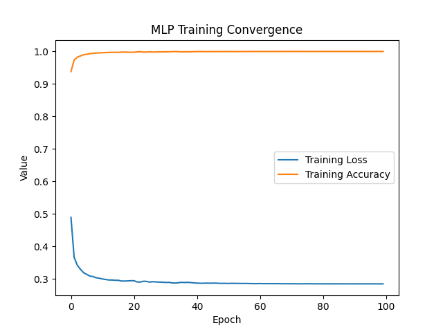

# ECS 170 — Stage 2 Report (MLP, PyTorch)

**Course:** ECS 170 (Spring 2026)  
**Task:** Stage 2 — Multiclass digit classification with a multilayer perceptron (PyTorch)

---

## Section 1: Task Description

Stage 2 is a **multiclass classification** problem on a **MNIST-style handwritten digit** dataset provided by the instructor. Each example is a flattened **784-dimensional** vector of pixel intensities (28×28) and an integer **label** in **10 classes** (digits 0–9).

The workflow follows the course template: load **pre-split** training and test CSV files, **train** an MLP with **PyTorch** using mini-batch gradient descent, save predictions, and report **Accuracy** plus **multiclass Precision, Recall, and F1** (weighted averages). A **training convergence** figure (loss vs. epoch, and training accuracy vs. epoch) summarizes optimization behavior.

---

## Section 2: Model Description

### 2.1 Architecture diagram

The model is a **fully connected (dense) MLP**. Each hidden block is **Linear → BatchNorm1d → ReLU → Dropout**; the final layer outputs **10 logits** (no softmax in the forward pass; **CrossEntropyLoss** applies log-softmax internally).

```mermaid
flowchart LR
  subgraph Input
    X["Input x\n(batch × 784)"]
  end

  subgraph B1["Block 1"]
    L1["Linear 784→512"]
    N1["BatchNorm1d(512)"]
    R1["ReLU"]
    D1["Dropout(p)"]
  end

  subgraph B2["Block 2"]
    L2["Linear 512→512"]
    N2["BatchNorm1d(512)"]
    R2["ReLU"]
    D2["Dropout(p)"]
  end

  subgraph B3["Block 3"]
    L3["Linear 512→256"]
    N3["BatchNorm1d(256)"]
    R3["ReLU"]
    D3["Dropout(p)"]
  end

  subgraph B4["Block 4"]
    L4["Linear 256→128"]
    N4["BatchNorm1d(128)"]
    R4["ReLU"]
    D4["Dropout(p)"]
  end

  subgraph Head
    L5["Linear 128→10"]
  end

  Z["Logits z\n(batch × 10)"]

  X --> L1 --> N1 --> R1 --> D1
  D1 --> L2 --> N2 --> R2 --> D2
  D2 --> L3 --> N3 --> R3 --> D3
  D3 --> L4 --> N4 --> R4 --> D4
  D4 --> L5 --> Z
```



### 2.2 Brief description

- **Input / output:** Real-valued **784**-D vectors (normalized pixel values); **10** logits for digit classes.  
- **Nonlinearity:** **ReLU** in hidden layers.  
- **Normalization / regularization:** **Batch normalization** after each hidden linear layer; **dropout** (`p = 0.1`, configurable in code) after each hidden ReLU (not after the final logits layer).  
- **Loss:** **Cross-entropy** with **label smoothing** (`0.05` when supported by the installed PyTorch).  
- **Optimization:** **AdamW** with **cosine annealing** of the learning rate over all training epochs.  
- **Training mode vs. evaluation:** During training, BatchNorm and Dropout use batch statistics and stochastic masking; at test time, `eval()` fixes BatchNorm running statistics and turns Dropout off.

**Depth / widths (hidden + output):** 784 → **512 → 512 → 256 → 128 → 10** (five linear layers, four hidden blocks with BN + ReLU + Dropout).

---

## Section 3: Experiment Settings

### 3.1 Dataset Description

| Item | Description |
|------|-------------|
| **Data source** | Instructor-provided CSVs under `ECS170_Spring_2026_Source_Code_Template/data/stage_2_data/` |
| **Train file** | `train.csv` — each row: **label** in column 0, **784 pixel** values in columns 1–784 |
| **Test file** | `test.csv` — same layout |
| **Partitioning** | **No additional split** in code: the **training** set is all rows of `train.csv`, the **held-out test** set is all rows of `test.csv`. Stage 2 does **not** use k-fold cross-validation. |
| **Preprocessing** | Pixel values are scaled to **[0, 1]** by dividing by **255.0** (see `Dataset_Loader.load()`). |

Only **one dataset** (this train/test pair) is used for Stage 2.

---

### 3.2 Detailed Experimental Setups

| Setting | Value |
|--------|--------|
| **Framework** | PyTorch (`nn.Module`), optional **CUDA** or **Apple MPS** if available, else **CPU** |
| **Architecture** | MLP: 784→512→512→256→128→10; BN + ReLU + Dropout after each hidden linear layer |
| **Batch size** | 256 |
| **Epochs** | 100 |
| **Optimizer** | AdamW |
| **Base learning rate** | 1e-3 |
| **Weight decay** | 1e-4 |
| **LR schedule** | CosineAnnealingLR, `T_max =` number of epochs |
| **Dropout probability** | 0.1 |
| **Label smoothing** | 0.05 (if `CrossEntropyLoss` supports it) |
| **Initialization** | Default PyTorch initialization for `Linear` and `BatchNorm1d` modules (no custom init in project code) |
| **Shuffle** | `shuffle=True` in `DataLoader` each epoch |

Because only one Stage 2 dataset is used, all of the above apply to **that** dataset. (Stage 1 in the template uses a different toy file and k-fold; this report focuses on **Stage 2**.)

---

### 3.3 Evaluation Metrics

We report standard **multiclass** metrics comparing **true labels** vs. **predicted labels** on the **test** set:

| Metric | Definition in this project |
|--------|----------------------------|
| **Accuracy** | Fraction of examples whose predicted class equals the true class. |
| **Precision (weighted)** | For each class, precision is computed; classes are aggregated by **support-weighted** average (`average='weighted'` in scikit-learn). |
| **Recall (weighted)** | Same aggregation as precision, using per-class recall. |
| **F1 (weighted)** | Harmonic mean of precision and recall per class, aggregated with **weighted** averaging. |

**Weighted** averaging is appropriate for multiclass problems and matches the course guidance (avoid plain **binary** metrics). We use `zero_division=0` in scikit-learn calls to avoid division-by-zero warnings on empty classes.

---

### 3.4 Source Code

**TODO (student):** Upload the project (or a release tag) to **GitHub** or another accessible host and paste the public link below.

- **Repository / Drive link:** *[Add your URL here]*  
- **Commit / version (optional):** *[e.g. git commit hash]*

The teaching assistant should use this link to inspect `ECS170_Spring_2026_Source_Code_Template/`, especially `local_code/stage_2_code/` and `script/stage_2_script/script_mlp.py`.

---

### 3.5 Training Convergence Plot

The training script saves a figure after each full training run:

- **File path (relative to template root):** `result/stage_2_result/mlp_convergence_plot.png`

From the **repository root** `pythonProject/`, you can embed the image in a PDF or document as:

`ECS170_Spring_2026_Source_Code_Template/result/stage_2_result/mlp_convergence_plot.png`

**What the plot shows:** The **x-axis** is **training epoch** (0 … 99). The **y-axis** is **value** on a shared scale: **training loss** (mean cross-entropy over the training set per epoch) and **training accuracy** (fraction correct on the training set after that epoch). Both curves are produced with **gradient descent** (AdamW), so the **loss** curve decreases overall and **accuracy** increases, illustrating **convergence** of the optimization process.

**Note for strict figure rubrics:** If the grader requires **loss only** on the y-axis, regenerate a loss-only plot from the saved `loss_history` in `Method_MLP.fit()` or plot loss in a separate subplot.



---

### 3.6 Model Performance

Numbers below are from a **completed training run** using the current Stage 2 pipeline: **train** on `train.csv`, **evaluate** on `test.csv`. Metrics come from `Evaluate_Accuracy` (sklearn) on **test** predictions.

| Split | Accuracy | Precision (weighted) | Recall (weighted) | F1 (weighted) |
|-------|----------|--------------------|-------------------|----------------|
| **Training** (end of epoch 99, illustrative) | ≈ 0.99998 | ≈ 0.99998 | ≈ 0.99998 | ≈ 0.99998 |
| **Test (held-out)** | **0.9876** | **0.987610** | **0.9876** | **0.987599** |

**Primary result to report for Stage 2:** **Test accuracy = 98.76%** (0.9876), with matching **weighted** precision, recall, and F1 as in the table.

*Training* metrics fluctuate slightly by run (hardware, ordering, etc.); the **test** row should be updated if you rerun and obtain different numbers.

---

### 3.7 Ablation Studies

The assignment asks for comparisons when changing **depth**, **width**, **loss**, or **optimizer**. Below is a **before/after** comparison grounded in experiments from this project’s development (same dataset and train/test protocol).

| Configuration | Architecture / training summary | Test accuracy | Notes |
|----------------|-----------------------------------|---------------|--------|
| **A — Shallow MLP (earlier baseline)** | 784→256→128→64→10, ReLU, **full-batch** Adam (`lr=1e-3`), **100** epochs, **no** BatchNorm / Dropout / LR schedule | **≈ 0.835** (83.5%) | Simpler capacity and optimization; underfits / optimizes less effectively than B. |
| **B — Current model (main result)** | 784→512→512→256→128→10 + **BN** + **Dropout**, **AdamW** + **cosine** LR, **mini-batch 256**, label smoothing, **100** epochs | **0.9876** (98.76%) | Large gain from deeper/wider net, batch training, and regularization/scheduler. |

**Optional extensions for the report (if time):**  
- Vary **depth** (e.g., remove one 512-wide block) or **width** (e.g., 256 instead of 512).  
- Compare **CrossEntropyLoss** with vs. without **label smoothing**.  
- Compare **Adam** vs. **AdamW** or **SGD + momentum** with tuned learning rate.

Record the **test** Accuracy and **weighted** Precision / Recall / F1 for each row in a small table like above.

---

## Appendix: How to reproduce (local)

From `ECS170_Spring_2026_Source_Code_Template/`:

```bash
export PYTHONPATH="$(pwd)"
python script/stage_2_script/script_mlp.py
```

Requires `train.csv` and `test.csv` in `data/stage_2_data/`.

---

*End of report (keep final PDF submission within the course page limit).*
