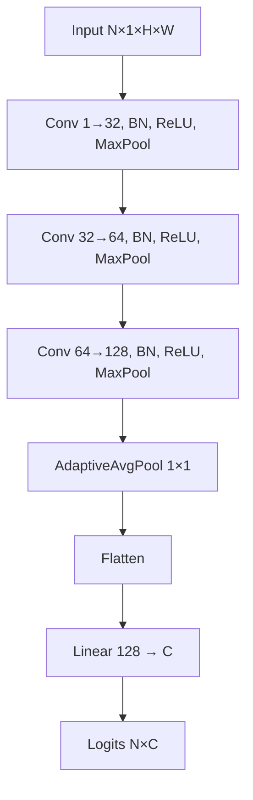

# ECS 170 — Stage 3 Report (CNN for Image Classification)

**Instructions for ChatGPT (paste this line first):**  
“Convert the report below into a clean, professional PDF under 5 pages. Use clear headings matching the section numbers. Keep tables readable. For architecture diagrams, either render the Mermaid code as figures or replace with equivalent simple block diagrams. Leave ONE placeholder line for the GitHub/Drive link if it still says PLACEHOLDER.”

---

## Section 1: Task Description

Stage 3 focuses on **convolutional neural networks (CNNs)** for **multiclass image classification** on three instructor-provided datasets:

1. **MNIST** — handwritten digits (10 classes).  
2. **ORL** — grayscale face images of 40 people (40 classes); the data are stored as 3 identical channels, but the pipeline uses **one channel**.  
3. **CIFAR-10** — small **color** natural images (10 object classes).

For each dataset, I **trained** a CNN **only on the official training split** and **evaluated** on the **held-out test split** from the provided pickles. I logged **training loss and training accuracy per epoch**, saved **convergence plots**, and reported **Accuracy** plus **multiclass Precision, Recall, and F1** (weighted averages) on the **test** set. Optional **ablation** compares a **shallow custom CNN** versus a **ResNet-18** setup on CIFAR-10 to show the impact of capacity, augmentation, schedule, and training length.

---

## Section 2: Model Description

### 2.1 Architecture A — Custom CNN (MNIST and ORL)

Used for **1-channel** inputs (MNIST 28×28, ORL 112×92 as 1×H×W after loading).

**Block pattern:** Conv 3×3 (padding 1) → BatchNorm → ReLU → MaxPool 2×2, repeated three times with channel widths **32 → 64 → 128**.  
**Head:** Global **AdaptiveAvgPool2d(1)** → **Flatten** → **Linear(128 → num_classes)**.

**Mermaid diagram (Custom CNN):**

- **MNIST:** C = 10 digits, H = W = 28.  
- **ORL:** C = 40 people, H = 112, W = 92.

**Loss:** Cross-entropy with **label smoothing** when supported by the PyTorch build.  
**Optimization (default in code):** **AdamW**, **cosine** learning-rate decay over all epochs, **weight decay** 1e-4.

### 2.2 Architecture B — ResNet-18 adapted for CIFAR-10 (RGB)

Used for **3-channel** 32×32 CIFAR images. Implemented with **`torchvision.models.resnet18`** pretrained **off**, with standard CIFAR modifications:

- Replace stem with **Conv2d(3→64, kernel 3, stride 1, padding 1, bias=False)**.  
- Replace first **MaxPool** with **Identity** (no downsample at the border).  
- Replace final **fc** with **Linear(512 → 10)**.

Residual stages follow the standard ResNet-18 layout (four blocks with skip connections).

**Training recipe (strong baseline):**  
- **Optimizer:** **SGD** with **momentum 0.9**, **Nesterov**, **weight decay 5e-4**, initial **LR 0.1**.  
- **Scheduler:** **CosineAnnealingLR** over **200** epochs.  
- **Augmentation:** **RandomCrop(32, padding=4)** + **RandomHorizontalFlip** (torchvision `v2`).  
- **Mixed precision:** **autocast** (FP16) on **GPU** when enabled.  
- **Batch size:** **256**.

---

## Section 3: Experiment Settings

### 3.1 Dataset Description

Data live under **`data/stage_3_data-2/`** as pickle files **`MNIST`**, **`ORL`**, **`CIFAR`** with structure `{'train': [...], 'test': [...]}`; each instance has **`image`** and **`label`**.

| Dataset | Train size | Test size | Input (as used) | Labels | Notes |
|---------|------------|-----------|-----------------|--------|--------|
| MNIST | 60,000 | 10,000 | 1×28×28, pixels scaled to ~[0,1] | 0–9 | Grayscale digits |
| ORL | 360 | 40 | 1×112×92, /255 | 0–39 in code | Original labels 1–40 → shifted to 0–39 for `CrossEntropyLoss` |
| CIFAR-10 | 50,000 | 10,000 | 3×32×32, /255 | 0–9 | RGB “objects” |

**Partitioning:** **No extra split** in code: **train** pickle list → training only; **test** pickle list → final evaluation only (same spirit as Stage 2’s fixed train/test).

### 3.2 Detailed Experimental Setups

| Setting | MNIST (custom CNN) | ORL (custom CNN) | CIFAR (ResNet-18) |
|---------|--------------------|------------------|-------------------|
| Script | `script_cnn_mnist.py` | `script_cnn_orl.py` | `script_cnn_cifar.py` |
| Epochs | 15 | 40 | 200 |
| Batch size | 128 | 32 | 256 |
| Optimizer | AdamW | AdamW | SGD (momentum 0.9, Nesterov) |
| Base LR | 1e-3 | 1e-3 | 0.1 |
| Weight decay | 1e-4 | 1e-4 | 5e-4 |
| LR schedule | Cosine (T_max = epochs) | Same | Same |
| Label smoothing | 0.05 | 0.05 | 0.05 |
| Augmentation | No | No | Yes (crop + flip) |
| Mixed precision | Off (default) | Off | On (`use_autocast`) |
| Hardware note | Local (e.g. MPS/CPU) | Local | **Google Colab NVIDIA GPU (CUDA)** for long ResNet run |
| Initialization | PyTorch defaults | PyTorch defaults | PyTorch defaults |

**Summary:** MNIST and ORL share the **same CNN architecture family** and **AdamW** recipe; **hyperparameters differ** (epochs, batch size, number of classes). CIFAR uses a **different backbone (ResNet-18)**, **SGD**, **strong augmentation**, **longer training**, and **GPU autocast** for efficiency.

### 3.3 Evaluation Metrics

All metrics are computed on the **test** split using **scikit-learn** after training completes.

- **Accuracy:** fraction of test images whose predicted class equals the true class.  
- **Precision (weighted):** class-wise precision averaged by **support** (weighted).  
- **Recall (weighted):** same weighting for recall.  
- **F1 (weighted):** harmonic mean of precision and recall per class, **weighted** by support.

**Why weighted:** CIFAR and MNIST are **multiclass**; ORL has **40 classes** with few test images per person—weighted summaries summarize overall behavior fairly. **`zero_division=0`** avoids undefined scores for empty classes.

### 3.4 Source Code

**Code location (local):** `ECS170_Spring_2026_Source_Code_Template/` — key paths: `local_code/stage_3_code/` (loader, `Method_CNN`, setting, metrics), `script/stage_3_script/` (three runners).  

**Public link for TA (required — replace before submitting):**  
**PLACEHOLDER:** _[Insert GitHub repository URL or Google Drive link to this project, with TA view permission.]_

### 3.5 Training Convergence Plot

For **each** dataset, training logs were saved after `Method_CNN.fit()`:

| Dataset | Plot file (under `result/stage_3_result/`) |
|---------|--------------------------------------------|
| MNIST | `cnn_mnist_convergence.png` |
| ORL | `cnn_orl_convergence.png` |
| CIFAR | `cnn_cifar_convergence.png` |

**Axes:** **x** = training epoch index (0 … T−1); **y** = **training loss** (mean cross-entropy over the training set per epoch) **and** **training accuracy** (fraction correct on the training set after that epoch), shown as **two curves** on the **same** figure (different scales in one panel).  

**Interpretation:** **Loss decreases** and **training accuracy increases** over epochs, illustrating **stable convergence** of the optimizer (AdamW or SGD + cosine). For the assignment’s emphasis on **loss vs epoch**, point to the **loss curve**; the accuracy curve further shows learning progress.

**Attach in PDF:** embed or paste the three PNGs in this subsection.

### 3.6 Model Performance (Test Set)

Numbers below are read from saved prediction pickles **`CNN_*_prediction_result_0`** (or equivalent console “Overall Performance” output). All are **test-set** metrics.

| Dataset | Accuracy | Precision (weighted) | Recall (weighted) | F1 (weighted) |
|---------|----------|----------------------|-------------------|---------------|
| MNIST | **0.9948** (99.48%) | 0.994803 | 0.9948 | 0.994799 |
| ORL | **0.9500** (95.00%) | 0.925000 | 0.9500 | 0.933333 |
| CIFAR-10 | **0.9502** (95.02%) | 0.950198 | 0.9502 | 0.950155 |

**Note (ORL):** Only **40** test images; metrics move in **2.5%** steps (each image is 2.5% of the set).

### 3.7 Ablation Studies

**Primary comparison (CIFAR-10):**  

| Configuration | Architecture / setup | Approx. test accuracy |
|---------------|------------------------|------------------------|
| **Baseline (weaker)** | Custom 3-block CNN (same family as MNIST/ORL), **no** train-time aug, **AdamW**, **shorter** training (e.g. ~20 epochs), local run | **~0.783** (78.3%) |
| **Strong model** | **ResNet-18** (CIFAR stem), **SGD**, **crop+flip augmentation**, **200 epochs**, cosine LR, **GPU** (Colab) | **0.9502** (95.02%) |

**Takeaway:** For CIFAR-10, **depth/capacity (ResNet)**, **data augmentation**, **optimizer/schedule (SGD + cosine)**, and **longer training** together yield a **large** jump in generalization (**~+17** percentage points on test in my runs).

**Optional further ablations** (if you rerun for the TA): change **kernel sizes**, **remove BatchNorm**, **vary depth** on the small CNN only, or compare **with vs without** augmentation on CIFAR with ResNet—all tabled with **test** Accuracy and weighted P/R/F1.

---

## Closing checklist for PDF export

- [ ] Replace **PLACEHOLDER** link in §3.4.  
- [ ] Insert **three convergence figures** in §3.5 (MNIST, ORL, CIFAR).  
- [ ] Keep total report **≤ 5 pages** per course policy (trim optional ablation bullets if needed).  
- [ ] Re-read **§3.6** numbers against your final pickles if you rerun any experiment.

---

*End of paste-ready report.*
