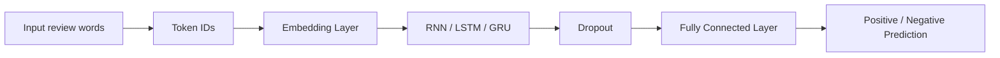
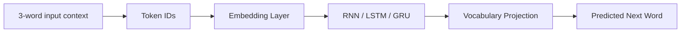
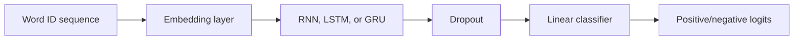
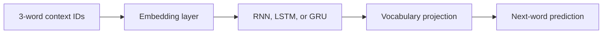

# ECS 170 Artificial Intelligence - Spring 2026
# Project Stage 4 Report: RNNs for Text Classification and Generation

## Team Information

Student 1: Ananth  
Student ID: 923809676  
Email: anramkumar@ucdavis.edu  

---

## Section 1: Task Description

In Stage 4, I studied recurrent neural networks (RNNs) for two text-based tasks: text classification and text generation. For the classification task, the goal was to classify IMDb movie reviews as either positive or negative. For the generation task, the goal was to train a recurrent model on a joke/story dataset and generate text starting from three given words.

The project required converting raw text into sequence data using tokenization and vocabulary indexing. I implemented RNN-based models using three recurrent units: vanilla RNN, LSTM, and GRU. The classification models were evaluated on the official test set using Accuracy, Precision, Recall, and F1 score. The generation models were evaluated by training loss, next-word prediction accuracy, and manual inspection of generated text.

---

## Section 2: Model Description

The same general model structure was used for RNN, LSTM, and GRU experiments. The main difference between the models is the recurrent unit.

For text classification, the model architecture was:



Each review was converted into a fixed-length sequence of word IDs. The word IDs were passed through an embedding layer, then processed by a recurrent layer. The final hidden representation was passed through dropout and a fully connected layer to predict whether the review was positive or negative.

For text generation, the model architecture was:



The generation model was trained as a next-word prediction model. Given a three-word context, the model predicts the next word. During generation, the predicted word is appended to the sequence, and the most recent three words are used to predict the following word. Generation stops when the model predicts `<EOS>` or reaches the maximum output length.

---

## Section 3: Experiment Settings

### 3.1 Dataset Description

Two text datasets were used.

For text classification, I used the IMDb sentiment classification dataset stored under `data/stage_4_data/text_classification/`. The dataset already contains an official train/test split. The training set contains 25,000 reviews, with 12,500 positive and 12,500 negative reviews. The test set also contains 25,000 reviews, with 12,500 positive and 12,500 negative reviews. The label was determined by the folder name: `pos = 1` and `neg = 0`.

For text generation, I used the joke dataset stored under `data/stage_4_data/text_generation/data`. The dataset contains 1,622 joke records. Each joke was tokenized into words, and an `<EOS>` token was appended to the end of each joke so the model could learn when to stop generation.

For preprocessing, I lowercased the text, removed HTML tags such as `<br />`, tokenized the text into words, and converted each word into an integer ID. The classification vocabulary used `<PAD>` and `<UNK>`. The generation vocabulary used `<PAD>`, `<UNK>`, and `<EOS>`. For classification, reviews were padded or truncated to a fixed maximum sequence length. For generation, I created sliding-window training examples where three input words predict the next word.

---

### 3.2 Detailed Experimental Setups

All models were implemented in PyTorch inside the provided project code template. The key implementation files were:

- `local_code/stage_4_code/Dataset_Loader.py`
- `local_code/stage_4_code/Method_RNN.py`
- `local_code/stage_4_code/Setting_Train_Test_Split.py`
- `local_code/stage_4_code/Evaluate_Accuracy.py`
- `local_code/stage_4_code/Result_Saver.py`

For classification, I tested vanilla RNN, LSTM, and GRU models. All classification models used an embedding layer, a bidirectional recurrent layer, dropout, and a fully connected output layer. The loss function was cross-entropy loss, and the optimizer was AdamW.

Classification settings:

| Model | Epochs | Embedding Dim | Hidden Size | Layers | Bidirectional | Batch Size | Notes |
|---|---:|---:|---:|---:|---|---:|---|
| RNN | 8 | 128 | 128 | 1 | Yes | 128 | Baseline recurrent model |
| LSTM | 10 | 128 | 160 | 1 | Yes | 128 | Gated recurrent model |
| GRU | 15 | 128 | 256 | 2 | Yes | 128 | Tuned best model |

The best GRU model used a larger vocabulary size of 30,000 and a maximum review length of 500 tokens. This model was selected as the main classification result.

For generation, I tested RNN, LSTM, and GRU models using a three-word context window. Each model used an embedding layer, a recurrent layer, and a vocabulary projection layer. The loss function was cross-entropy loss, and the optimizer was AdamW.

Generation settings:

| Model | Epochs | Context Length | Embedding Dim | Hidden Size | Batch Size |
|---|---:|---:|---:|---:|---:|
| RNN | 50 | 3 | 128 | 128 | 128 |
| LSTM | 60 | 3 | 128 | 128 | 128 |
| GRU | 60 | 3 | 128 | 128 | 128 |

The full experiments were run on Google Colab using an NVIDIA A100 GPU with CUDA.

---

### 3.3 Evaluation Metrics

For classification, I used Accuracy, weighted Precision, weighted Recall, and weighted F1 score.

Accuracy measures the percentage of test samples classified correctly. Precision measures how many predicted labels were correct, Recall measures how many true labels were recovered, and F1 score is the harmonic mean of Precision and Recall. I used weighted averages for Precision, Recall, and F1 so that the metric accounts for class support.

For text generation, I reported next-word prediction accuracy on the validation set, training convergence, and generated text examples. Since text generation does not have a single required numeric benchmark in this project, I also manually inspected whether the generated samples followed joke-like sentence patterns.

---

### 3.4 Source Code

The source code is located in the project folder:

`ECS170_Spring_2026_Source_Code_Template/`

Key Stage 4 folders:

- `local_code/stage_4_code/`
- `script/stage_4_script/`
- `data/stage_4_data/`
- `result/stage_4_result/`

Public link for TA:  
**PLACEHOLDER: Insert GitHub or Google Drive link here.**

---

### 3.5 Training Convergence Plot

The training convergence plots were saved under:

`result/stage_4_result/`

Classification plots:

- `rnn_classification_convergence.png`
- `lstm_classification_convergence.png`
- `gru_classification_convergence_v2.png`

Generation plots:

- `rnn_generation_convergence.png`
- `lstm_generation_convergence.png`
- `gru_generation_convergence.png`

The x-axis represents training epoch, and the y-axis shows the training loss and accuracy-related curves. In general, training loss decreased over time, showing that gradient descent was successfully optimizing the recurrent models. For classification, training accuracy increased significantly across epochs. For generation, training loss decreased steadily, while validation next-word accuracy improved early and then stabilized.

---

### 3.6 Model Performance

Classification performance on the IMDb test set:

| Model | Accuracy | Precision (Weighted) | Recall (Weighted) | F1 (Weighted) |
|---|---:|---:|---:|---:|
| RNN | 0.7878 | 0.7879 | 0.7878 | 0.7878 |
| LSTM | 0.8483 | 0.8484 | 0.8483 | 0.8483 |
| GRU | **0.8750** | **0.8752** | **0.8750** | **0.8750** |

The GRU model achieved the best classification performance with 87.50% test accuracy. This exceeds the required 85% benchmark for Stage 4.

Generation validation performance:

| Model | Next-Word Accuracy | Precision (Weighted) | Recall (Weighted) | F1 (Weighted) |
|---|---:|---:|---:|---:|
| RNN | 0.2030 | 0.1416 | 0.2030 | 0.1568 |
| LSTM | 0.1964 | 0.1421 | 0.1964 | 0.1580 |
| GRU | **0.2040** | **0.1436** | **0.2040** | **0.1591** |

Generated examples:

RNN generation:

- Seed: `what do you`  
  Output: `what do you call 99 bunnies walking forward from a duck`
- Seed: `why did the`  
  Output: `why did the buddhist say when confronted he had a great spill`

LSTM generation:

- Seed: `what do you`  
  Output: `what do you call people who pretend to be irish on st patrick's day counterfitz`
- Seed: `why did the`  
  Output: `why did the chicken lay a charging`

GRU generation:

- Seed: `what do you`  
  Output: `what do you call a bra with a twitch in mathematics the black denims say to the other can because he was always`
- Seed: `why did the`  
  Output: `why did the desk lamp store bucket cleaver all they just be an operation on the other side`

The generated outputs are not always grammatically correct, but they show that the models learned common joke openings and short joke-like structures from the training data. The GRU model achieved the highest next-word accuracy among the generation models.

---

### 3.7 Ablation Studies

The main ablation study changed the recurrent unit while keeping the overall model pipeline the same. I compared vanilla RNN, LSTM, and GRU units for both classification and generation.

For classification, the vanilla RNN performed the worst with 78.78% accuracy. This is expected because vanilla RNNs can struggle to preserve information over longer text sequences. The LSTM improved performance to 84.83%, showing the benefit of gated memory. The GRU performed best with 87.50% accuracy, exceeding the assignment benchmark. The GRU likely performed well because it uses gating to control information flow while being simpler than LSTM.

For generation, all three models produced imperfect but recognizable joke-like text. GRU achieved the highest next-word validation accuracy at 20.40%, followed closely by RNN at 20.30% and LSTM at 19.64%. The generated text sometimes mixed fragments from different jokes, which is reasonable because the dataset is small and many jokes share common three-word openings.

Ablation summary:

| Task | Best Model | Main Observation |
|---|---|---|
| Classification | GRU | Best accuracy and exceeded 85% benchmark |
| Generation | GRU | Highest next-word validation accuracy |
| Manual Generation Quality | LSTM / RNN / GRU mixed | All generated joke-like text, but grammar was imperfect |

Overall, the experiments show that gated recurrent units improve text classification performance compared with vanilla RNNs. For generation, all recurrent variants learned common short joke structures, but the small dataset limited fluency and consistency.

---

## Conclusion

In this stage, I implemented RNN, LSTM, and GRU models for text classification and generation. The best classification model was a bidirectional GRU, which achieved 87.50% test accuracy on IMDb sentiment classification and passed the required 85% benchmark. For text generation, the recurrent models successfully generated text from three-word prompts. Although the generated sentences were imperfect, they showed learned joke-style patterns from the training dataset. The ablation study confirmed that GRU was the strongest overall model for this project stage.
# ECS 170 — Stage 4 Report Draft (RNNs for Text Classification and Generation)

**Instructions for ChatGPT or document editor:** Convert this draft into a clean PDF under 5 pages. Replace the classification placeholder metrics after running the full IMDb classification experiments, and insert the saved convergence plots from `result/stage_4_result/`.

---

## Section 1: Task Description

Stage 4 studies recurrent neural networks for two natural language tasks:

1. **Text classification:** classify IMDb movie reviews as positive or negative.
2. **Text generation:** train a recurrent model on short jokes and generate a new joke/story from three starting words.

I implemented one configurable PyTorch recurrent model family and evaluated **RNN**, **LSTM**, and **GRU** variants. The code follows the same professor template pattern used in earlier stages: `Dataset_Loader`, `Method_RNN`, `Result_Saver`, `Setting_Train_Test_Split`, and `Evaluate_Accuracy`.

---

## Section 2: Data Preparation

### 2.1 Text Classification Dataset

The classification data are stored under `data/stage_4_data/text_classification/` with an official train/test split:

| Split | Negative reviews | Positive reviews | Total |
|-------|------------------|------------------|-------|
| Train | 12,500 | 12,500 | 25,000 |
| Test | 12,500 | 12,500 | 25,000 |

The label is derived from the folder name: `neg = 0`, `pos = 1`.

Preprocessing:

- Convert text to lowercase.
- Remove HTML tags such as `<br />`.
- Normalize text into word tokens using a regular expression tokenizer.
- Build the vocabulary from training reviews only.
- Use `<PAD>` for padding and `<UNK>` for unknown words.
- Convert each review into word IDs.
- Pad or truncate reviews to a fixed maximum sequence length.

### 2.2 Text Generation Dataset

The generation data are stored in `data/stage_4_data/text_generation/data`. The file contains 1,622 short jokes. Each row has an `ID` and a `Joke`.

Preprocessing:

- Tokenize each joke into words.
- Append `<EOS>` to each joke so the model can learn when to stop.
- Include `<PAD>`, `<UNK>`, and `<EOS>` in the vocabulary.
- Create sliding-window examples with three-word context:

```text
what did the -> bartender
did the bartender -> say
the bartender say -> to
```

The generation model therefore learns next-word prediction and can generate text autoregressively from three seed words.

---

## Section 3: Model Description

### 3.1 Classification Model

The classifier uses:



For each review, the recurrent model processes the padded token sequence. The final valid timestep representation is passed through dropout and a linear layer. Training uses cross-entropy loss and AdamW.

The implemented variants are:

| Variant | Script |
|---------|--------|
| RNN | `script_rnn_classification.py` |
| LSTM | `script_lstm_classification.py` |
| GRU | `script_gru_classification.py` |

The main result should use the best full-training model. The project benchmark requires at least one of RNN, LSTM, or GRU to reach **85% test accuracy or higher**.

### 3.2 Generation Model

The generator uses:



At generation time, the model repeatedly predicts the next word, appends it to the output, and shifts the three-word context window. Generation stops when `<EOS>` is produced or when the maximum output length is reached.

---

## Section 4: Experiment Settings

All scripts are located under `script/stage_4_script/`. Results and plots are saved under `result/stage_4_result/`.

Classification default settings:

| Setting | RNN | LSTM | GRU |
|---------|-----|------|-----|
| Embedding size | 128 | 128 | 128 |
| Hidden size | 128 | 160 | 160 |
| Bidirectional | Yes | Yes | Yes |
| Batch size | 128 | 128 | 128 |
| Epochs | 8 | 10 | 10 |
| Optimizer | AdamW | AdamW | AdamW |
| Loss | Cross-entropy | Cross-entropy | Cross-entropy |

Generation default settings:

| Setting | RNN | LSTM | GRU |
|---------|-----|------|-----|
| Context length | 3 | 3 | 3 |
| Embedding size | 128 | 128 | 128 |
| Hidden size | 128 | 128 | 128 |
| Batch size | 128 | 128 | 128 |
| Epochs | 50 | 60 | 60 |
| Optimizer | AdamW | AdamW | AdamW |
| Loss | Cross-entropy | Cross-entropy | Cross-entropy |

Hardware note: the code automatically uses CUDA, Apple MPS, or CPU. Smoke tests and the full LSTM generation run were completed locally on Apple MPS. Full IMDb classification training should be run on Google Colab CUDA if local runtime is too slow.

---

## Section 5: Results

### 5.1 Smoke-Test Results

Smoke tests used a small sample and short training only to verify that loading, training, evaluation, plotting, and result saving work. These numbers are **not** final model performance.

| Task | Model | Smoke setting | Accuracy |
|------|-------|---------------|----------|
| Classification | RNN | 200 train reviews, 1 epoch | 0.43 |
| Classification | LSTM | 200 train reviews, 1 epoch | 0.53 |
| Classification | GRU | 200 train reviews, 1 epoch | 0.49 |
| Generation | RNN | 400 windows, 2 epochs | 0.025 |
| Generation | LSTM | 400 windows, 2 epochs | 0.175 |
| Generation | GRU | 400 windows, 2 epochs | 0.000 |

### 5.2 Full Text Generation Result

I completed a full local LSTM generation run for 60 epochs. The training loss decreased from **7.2296** at epoch 0 to **0.3833** at epoch 59. The best validation next-word accuracy was about **0.2021**.

Example generated outputs:

| Seed words | Generated text |
|------------|----------------|
| `what do you` | what do you call a romanian grocery clerk scanthesku |
| `why did the` | why did the pony say when it hit the wall oh dam |
| `what did the` | what did the eye say to the horn less the two home because he knew his parents will make him return it |
| `the movie was` | the movie was constipated why so one math book say to the other do you smell fish |

The generated text is not always grammatically perfect, but it does learn joke-like openings and short punchline structure. This is expected because the dataset is small and many jokes share common starts such as `what do you`, `why did the`, and `what did the`.

### 5.3 Full Classification Result

Full IMDb classification should be run with:

```bash
cd ECS170_Spring_2026_Source_Code_Template
python script/stage_4_script/script_gru_classification.py
python script/stage_4_script/script_lstm_classification.py
python script/stage_4_script/script_rnn_classification.py
```

After running the full experiments, replace this table with the final test metrics:

| Model | Accuracy | Precision (weighted) | Recall (weighted) | F1 (weighted) |
|-------|----------|----------------------|-------------------|---------------|
| RNN | TODO | TODO | TODO | TODO |
| LSTM | TODO | TODO | TODO | TODO |
| GRU | TODO | TODO | TODO | TODO |

The main result section should highlight whichever model reaches or exceeds the required **85%** test accuracy. Based on the model design, the GRU or LSTM is the expected best candidate.

---

## Section 6: Ablation and Discussion

The RNN, LSTM, and GRU variants share the same data preprocessing and training pipeline, so differences mainly come from the recurrent cell. The vanilla RNN is simpler but can struggle with longer review sequences. LSTM and GRU add gating mechanisms, which should help preserve useful sentiment information over longer text.

For classification, the most important tuning knobs are:

- Maximum review length.
- Vocabulary size.
- Hidden size.
- Bidirectional recurrent layers.
- Number of training epochs.
- Learning rate and dropout.

For generation, the LSTM model produced the most useful local result among the tested runs. It learned common joke patterns, but because the dataset is small, the output can mix memorized fragments with unusual phrases.

---

## Section 7: Source Code and Output Files

Key code files:

- `local_code/stage_4_code/Dataset_Loader.py`
- `local_code/stage_4_code/Method_RNN.py`
- `local_code/stage_4_code/Setting_Train_Test_Split.py`
- `local_code/stage_4_code/Evaluate_Accuracy.py`
- `local_code/stage_4_code/Result_Saver.py`
- `script/stage_4_script/`

Saved plots and result files:

- `result/stage_4_result/rnn_classification_convergence.png`
- `result/stage_4_result/lstm_classification_convergence.png`
- `result/stage_4_result/gru_classification_convergence.png`
- `result/stage_4_result/rnn_generation_convergence.png`
- `result/stage_4_result/lstm_generation_convergence.png`
- `result/stage_4_result/gru_generation_convergence.png`
- `result/stage_4_result/*_prediction_result_0`

**Public link for TA:** PLACEHOLDER — insert GitHub or Google Drive link before submitting.
